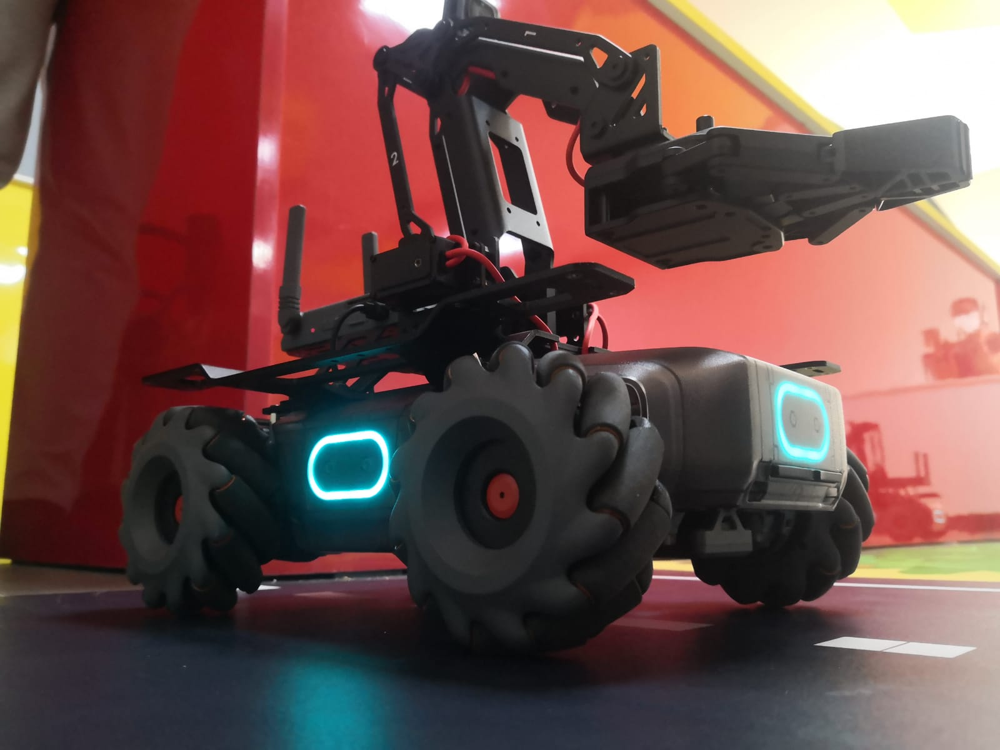
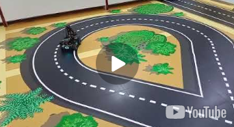

# MobileRobot-Openloopcontrol
## Aim:

To develop a python control code to move the mobilerobot along the predefined path.

## Equipments Required:
1. RoboMaster EP core
2. Python 3.7

## Procedure

Step1:
Use from robomaster import robotUse from robomaster import robot
<br/>

Step2:
Choose the x,y,z - axis movement distance(meters)
<br/>

Step3:
Give ep_chassis.move to move straight
<br/>

Step4:
Give time.sleep() for a break.
<br/>

Step5:
Give ep_chassis.drive_speed to have a circular movement.
<br/>

## Program
```python
from robomaster import robot
import time

if __name__ == '__main__':
    ep_robot = robot.Robot()
    ep_robot.initialize(conn_type="ap")

    ep_chassis = ep_robot.chassis

        '''
    x = x-axis movement distance,( meters) [-5,5]
    y = y-axis movement distance,( meters) [-5,5]
    z = rotation about z axis ( degree)[-180,180]
    xy_speed = xy axis movement speed,( unit meter/second) [0.5,2]
    '''
    ep_chassis.move(x=3.2, y=0, z=0, xy_speed=0.75).wait_for_completed()

    ep_chassis.move(x=0, y=0, z=45, xy_speed=1).wait_for_completed()

    ep_chassis.move(x=1.4, y=0, z=0, xy_speed=0.75).wait_for_completed()
    ep_chassis.move(x=0, y=0, z=90, xy_speed=1).wait_for_completed()
    ep_chassis.move(x=1.6, y=0, z=0, xy_speed=0.75).wait_for_completed()
    ep_chassis.move(x=0, y=0, z=-35, xy_speed=1).wait_for_completed()
    ep_chassis.move(x=1.0, y=0, z=0, xy_speed=0.75).wait_for_completed()
    ep_chassis.move(x=0, y=0, z=-45, xy_speed=1).wait_for_completed()
    ep_chassis.move(x=0.5, y=0, z=0, xy_speed=0.75).wait_for_completed()
    ep_chassis.move(x=0, y=0, z=-35, xy_speed=0.75).wait_for_completed()
    ep_chassis.move(x=0.8, y=0, z=0, xy_speed=0.75).wait_for_completed()
    ep_chassis.move(x=0, y=0, z=-35, xy_speed=0.75).wait_for_completed()
    ep_chassis.move(x=0.9, y=0, z=0, xy_speed=0.75).wait_for_completed()
    ep_chassis.move(x=0, y=0, z=-45, xy_speed=0.75).wait_for_completed()
    ep_chassis.move(x=0.9, y=0, z=0, xy_speed=0.75).wait_for_completed()
    ep_chassis.move(x=0, y=0, z=-45, xy_speed=0.75).wait_for_completed()
    ep_robot.close()
```

## MobileRobot Movement Image:


<br/>
<br/>
<br/>
<br/>

## MobileRobot Movement Video:

Upload your video in Youtube and paste your video-id here

[](https://youtu.be/U2cmSvStJg8)

<br/>
<br/>
<br/>
<br/>

## Result:
Thus the python program code is developed to move the mobilerobot in the predefined path.


<br/>
<br/>

```
Mobile Robotics Laboratory
Department of Artificial Intelligence and Data Science/ Machine Learning
Saveetha Engineering College
```
